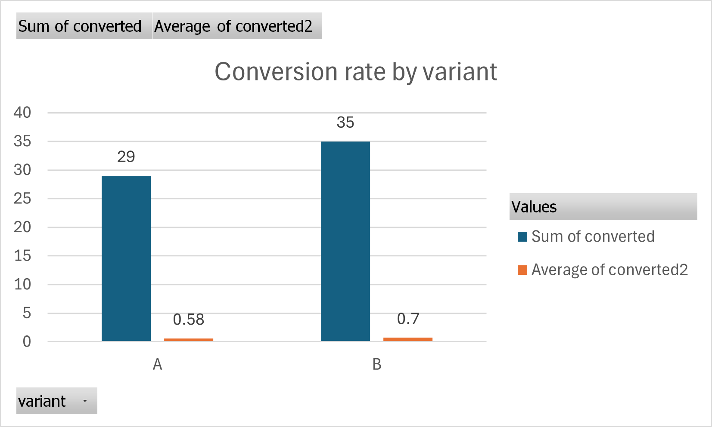

# A/B Testing & Policy Impact Analytics

This project is my small, end-to-end example of how I would approach an experiment in a real job:  
**define the question → structure the data → analyse in SQL/Excel/Python → make a decision.**

**Target roles:** Data Analyst · Business Analyst · Product Analyst · Policy Analyst  
**Industries:** Government digital services, online portals, fintech/edtech platforms, healthcare booking systems

---

## 1. Problem & Context

Think of a government or online service where people need to complete an important action:

- apply for a permit,
- book a health appointment,
- sign up for a benefit or program.

The product/policy team is testing a new version of the page:

- **Version A** – current/old design or policy  
- **Version B** – new design or policy that is supposed to improve completion

The core question I’m answering in this project is:

> **Does Version B actually convert better than Version A, and by how much?**

---

## 2. What I Built

For this project I put together a small, but complete, workflow:

- A **structured experiment dataset**: `data/ab_test_results.csv`
- A **database-friendly schema** and **SQL analysis queries**: `sql/`
- A simple **Excel A/B calculator** that a non-technical manager can use: `excel/ab_test_calculator.xlsx`
- A **Python analysis script** using pandas: `notebooks/ab_test_analysis.py`

Together, these pieces show that I can move comfortably between **data**, **code**, **Excel**, and **business questions**.

## 3. What I Built (Overview)

This is a small but complete workflow:

- ✅ A structured **experiment dataset**:  
  [`data/ab_test_results.csv`](data/ab_test_results.csv)
- ✅ A **database schema** and **SQL analysis queries**:  
  [`sql/schema.sql`](sql/schema.sql), [`sql/queries.sql`](sql/queries.sql)
- ✅ A manager-friendly **Excel A/B calculator**:  
  [`excel/ab_test_calculator.xlsx`](excel/ab_test_calculator.xlsx)
- ✅ A **Python analysis script** using `pandas`:  
  [`notebooks/ab_test_analysis.py`](notebooks/ab_test_analysis.py)

---

## 3. Data

The main dataset is stored in [`data/ab_test_results.csv`](data/ab_test_results.csv).

Each row represents **one user/session** in the experiment, with:

- `user_id` – unique ID per user/session  
- `variant` – `'A'` (old) or `'B'` (new)  
- `device` – e.g. `mobile` or `desktop`  
- `region` – e.g. `North`, `South`, `East`, `West`  
- `date` – date of the visit  
- `converted` – `1` if the user completed the target action, `0` otherwise  

For this sample:

- **Total visits:** 100  
- **Total conversions:** 64  
- **Overall conversion rate:** 64%

The data is synthetic (I created it myself), but the structure and analysis are exactly what I would do with real production data.

---

## 4. Key Results from This Experiment

### 4.1 Conversion by variant

| Variant | Visits | Conversions | Conversion rate |
|---------|--------|------------:|----------------:|
| A       | 50     | 29          | 58%             |
| B       | 50     | 35          | 70%             |

Overall across both variants:

- **Total visits:** 100  
- **Total conversions:** 64  
- **Overall conversion rate:** 64%

In simple terms:

> Version **B** converts **12 percentage points** better than Version **A** in this sample (70% vs 58%).

### 4.2 (Optional) Visual

If you’ve cloned the repo and generated the chart, the README can show a simple visual like:



*(If the image doesn’t show yet, it just means the PNG hasn’t been uploaded to `images/`—the analysis still works.)*

---

## 5. How I Implemented It

### 5.1 SQL – Schema & Core Queries

In [`sql/schema.sql`](sql/schema.sql) I define a simple table:

```sql
CREATE TABLE ab_test_results (
    user_id   INTEGER,
    variant   CHAR(1),
    device    VARCHAR(20),
    region    VARCHAR(20),
    date      DATE,
    converted INTEGER
);
